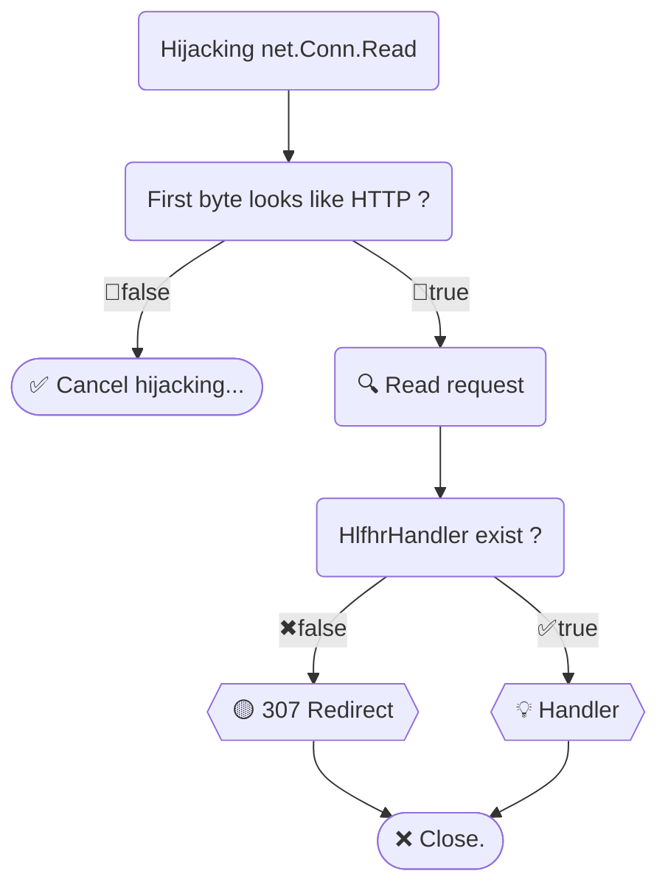

# HTTPS Listener For HTTP Redirect

Redirecting from HTTP to HTTPS on the ***same port***, similar to [nginx's `error_page 497`](https://github.com/bddjr/hlfhr/discussions/18).  
It can also redirect from port 80 to port 443.

> This is my original work - the first solution to [the issue](https://github.com/golang/go/issues/49310) without modifying the standard library.  
> If you like it, please give me a star⭐. Thanks! 😊  

## Setup

```
go get github.com/bddjr/hlfhr
```

```go
// Use hlfhr.New
srv := hlfhr.New(&http.Server{
	// Write something...
})

// Port 80 redirects to port 443.  
// This option only takes effect when listening on port 443.
srv.Listen80RedirectTo443 = true

// Then just use it like [http.Server]
err := srv.ListenAndServeTLS("example.crt", "example.key")
```

For example:
- Listening on port 8443, `http://127.0.0.1:8443` will redirect to `https://127.0.0.1:8443`.  
- Listening on port 443, `http://127.0.0.1` will redirect to `https://127.0.0.1`.  

If you need to customize the redirect handler, see [HlfhrHandler Example](#HlfhrHandler-example).

---

## Logic



---

## HlfhrHandler Example

> If you need `http.Hijacker` or `http.ResponseController.EnableFullDuplex`, please use [hahosp](https://github.com/bddjr/hahosp).

```go
// Check Host Header
srv.HlfhrHandler = http.HandlerFunc(func(w http.ResponseWriter, r *http.Request) {
	hostname, _port := r.Host, ""
	if !strings.HasSuffix(hostname, "]") {
		if i := strings.LastIndexByte(hostname, ':'); i != -1 {
			_port = hostname[i:]
			hostname = hostname[:i]
		}
	}
	switch hostname {
	case "localhost":
		//
	case "www.localhost", "127.0.0.1":
		r.Host = "localhost" + _port
	default:
		w.WriteHeader(421)
		return
	}
	hlfhr_utils.RedirectToHttps(w, r, 307)
})
```

---

## Test

Linux:
```
git clone https://github.com/bddjr/hlfhr
cd hlfhr
cd testdata
sudo go test
sudo go run main.go
```

Windows:
```
git clone https://github.com/bddjr/hlfhr
cd hlfhr
cd testdata
go test
go run main.go
```

---

## Reference

https://github.com/golang/go/issues/49310  

https://developer.mozilla.org/docs/Web/HTTP

https://nginx.org/en/docs/http/ngx_http_ssl_module.html#errors

---

## License

[BSD-3-clause](LICENSE.txt), Same as Golang.
