# HTTPS Listener For HTTP Redirect

🌐 HTTP redirect to HTTPS on the **same port** using Golang.  
It can also redirect from port 80 to port 443.

> This is my original work - the first solution to [the issue](https://github.com/golang/go/issues/49310) without modifying the standard library.  

## Setup

```
go get -u github.com/bddjr/hlfhr@latest
```

```go
// Use [hlfhr.New]
srv := hlfhr.New(&http.Server{
	// Write something...
})

// Port 80 redirects to port 443.  
// This option only takes effect when listening on port 443.
// [hlfhr.Server.HlfhrHandler] is also using on port 80.
srv.Listen80RedirectTo443 = true

// Then just use it like [http.Server]
err := srv.ListenAndServeTLS("example.crt", "example.key")
```

For example:
- Listening on port 8443, `http://127.0.0.1:8443` will redirect to `https://127.0.0.1:8443`.  
- Listening on port 443, `http://127.0.0.1` will redirect to `https://127.0.0.1`.  

If you need to customize the redirect handler, see [HlfhrHandler Example](#hlfhrhandler-example).

---

## VS

`github.com/bddjr/hlfhr` VS [`github.com/bddjr/hahosp`](https://github.com/bddjr/hahosp)

| Feature | hlfhr | hahosp |
| ---- | ---- | ---- |
| Redirect to HTTPS without modify `Server.Handler` | ✅ | ❌ Need modify to `hahosp.HandlerSelector` |
| Listen 80 redirect to 443 | ✅ Need config | ❌ |
| Without modify `Server.ListenAndServeTLS` | ✅ | ❌ Need modify to `hahosp.ListenAndServe` |
| Without modify type `http.Server` | ❌ Need modity to `hlfhr.Server` | ✅ |
| WebSocket on HTTP (not HTTPS) | ❌ Unsupport `http.Hijacker` | ✅ |
| Keep alive on HTTP (not HTTPS) | ❌ | ✅ |

---

## Logic

```mermaid
flowchart TD
	Read("Hijacking net.Conn.Read")

	IsLooksLikeHTTP("First byte looks like HTTP ?")

	CancelHijacking(["✅ Cancel hijacking..."])

	ReadRequest("🔍 Read request")

	IsHandlerExist("HlfhrHandler exist ?")

	Redirect{{"🟡 307 Redirect"}}

	Handler{{"💡 Handler"}}

	Close(["❌ Close."])

    Read --> IsLooksLikeHTTP
    IsLooksLikeHTTP -- "🔐false" --> CancelHijacking
    IsLooksLikeHTTP -- "📄true" --> ReadRequest --> IsHandlerExist
	IsHandlerExist -- "✖false" --> Redirect --> Close
	IsHandlerExist -- "✅true" --> Handler --> Close
```



---

## HlfhrHandler Example

> If you need `http.Hijacker` on HTTP (not HTTPS), please use [github.com/bddjr/hahosp](https://github.com/bddjr/hahosp)

```go
// 308 Permanent Redirect
srv.HlfhrHandler = http.HandlerFunc(func(w http.ResponseWriter, r *http.Request) {
	hlfhr_utils.RedirectToHttps(w, r, 308)
})
```

```go
// Check Host Header
srv.HlfhrHandler = http.HandlerFunc(func(w http.ResponseWriter, r *http.Request) {
	hostname, _port := r.Host, ""
	if !strings.HasSuffix(hostname, "]") {
		if i := strings.LastIndexByte(hostname, ':'); i != -1 {
			_port = hostname[i:]
			if _port == ":80" {
				_port = ""
			}
			hostname = hostname[:i]
		}
	}
	switch hostname {
	case "localhost":
		hlfhr_utils.RedirectToHttps(w, r, 307)
	case "www.localhost", "127.0.0.1", "[::1]":
		hlfhr_utils.RedirectToHttps_ModifyHost(w, r, 307, "localhost"+_port)
	default:
		w.WriteHeader(421)
	}
})
```
