# HTTPS Listener For HTTP Redirect

If client sent an HTTP request to an HTTPS server `port`, returns [302 redirection](https://developer.mozilla.org/docs/Web/HTTP/Status/302), like [nginx](https://nginx.org)'s ["error_page 497"](https://nginx.org/en/docs/http/ngx_http_ssl_module.html#errors).

Related issue: https://github.com/golang/go/issues/49310

> [!IMPORTANT]
> If you need `http.Hijacker` or `http.ResponseController.EnableFullDuplex`, please use https://github.com/bddjr/hahosp

---

## Get

```
go get github.com/bddjr/hlfhr
```

---

## Example

```go
// Use hlfhr.New
srv := hlfhr.New(&http.Server{
	// Write something...
})
// Then just use it like [http.Server]
err := srv.ListenAndServeTLS("localhost.crt", "localhost.key")
```

---

## Logic

```mermaid
flowchart TD
	Read("Hijacking net.Conn.Read")

	IsLooksLikeHTTP("First byte looks like HTTP ?")

	Continue(["✅ Continue..."])

	ReadRequest("🔍 Read request")

	IsFindHostHeader("Find Host header ?")

	IsHandlerExist("`
	HttpOnHttpsPort
	ErrorHandler
	exist?`")

	400BadRequest{{"❌ 400 Bad Request"}}

	302Redirect{{"🟡 302 Redirect"}}

	Handler{{"💡 Handler"}}

	Close(["❌ Close."])

    Read --> IsLooksLikeHTTP
    IsLooksLikeHTTP -- "🔐false" --> Continue
    IsLooksLikeHTTP -- "📄true" --> ReadRequest --> IsFindHostHeader
    IsFindHostHeader -- "⛔false" --> 400BadRequest --> Close
    IsFindHostHeader -- "✅true" --> IsHandlerExist
	IsHandlerExist -- "✖false" --> 302Redirect --> Close
	IsHandlerExist -- "✅true" --> Handler --> Close
```



### See

- [curl](curl.md)
- [src_server.go](src_server.go)
- [src_tlslistener.go](src_tlslistener.go)
- [src_conn.go](src_conn.go)
- [src_conn-looks-like-http.go](src_conn-looks-like-http.go)

---

## Option Example

#### HttpOnHttpsPortErrorHandler

```go
// 307 Temporary Redirect
srv.HttpOnHttpsPortErrorHandler = http.HandlerFunc(func(w http.ResponseWriter, r *http.Request) {
	hlfhr.RedirectToHttps(w, r, 307)
})
```

```go
// Check Host Header
srv.HttpOnHttpsPortErrorHandler = http.HandlerFunc(func(w http.ResponseWriter, r *http.Request) {
	hostname, port := hlfhr.SplitHostnamePort(r.Host)
	switch hostname {
	case "localhost":
		//
	case "www.localhost", "127.0.0.1":
		r.Host = hlfhr.HostnameAppendPort("localhost", port)
	default:
		w.WriteHeader(421)
		return
	}
	hlfhr.RedirectToHttps(w, r, 302)
})
```

```go
// Script Redirect
srv.HttpOnHttpsPortErrorHandler = http.HandlerFunc(func(w http.ResponseWriter, r *http.Request) {
	w.Header().Set("Content-Type", "text/html")
	w.WriteHeader(300)
	io.WriteString(w, "<script>location.protocol='https:'</script>")
})
```

---

## Method Example

#### New

```go
srv := hlfhr.New(&http.Server{
	// Write something...
})
```

#### NewServer

```go
srv := hlfhr.NewServer(&http.Server{
	// Write something...
})
```

#### ListenAndServeTLS

```go
// Just use it like [http.ListenAndServeTLS]
var h http.Handler
err := hlfhr.ListenAndServeTLS(":443", "localhost.crt", "localhost.key", h)
```

#### ServeTLS

```go
// Just use it like [http.ServeTLS]
var l net.Listener
var h http.Handler
err := hlfhr.ServeTLS(l, h, "localhost.crt", "localhost.key")
```

#### Redirect

```go
var w http.ResponseWriter
hlfhr.Redirect(w, 302, "https://example.com/")
```

#### RedirectToHttps

```go
var w http.ResponseWriter
var r *http.Request
hlfhr.RedirectToHttps(w, r, 302)
```

#### SplitHostnamePort

```go
hostname, port := hlfhr.SplitHostnamePort("[::1]:5678")
// hostname: [::1]
// port: 5678
```

#### Hostname

```go
hostname := hlfhr.Hostname("[::1]:5678")
// hostname: [::1]
```

#### Port

```go
port := hlfhr.Port("[::1]:5678")
// port: 5678
```

#### HostnameAppendPort

```go
Host := hlfhr.HostnameAppendPort("[::1]", "5678")
// Host: [::1]:5678
```

#### ReplaceHostname

```go
Host := hlfhr.ReplaceHostname("[::1]:5678", "localhost")
// Host: localhost:5678
```

#### ReplacePort

```go
Host := hlfhr.ReplacePort("[::1]:5678", "7890")
// Host: [::1]:7890
```

#### Ipv6CutPrefixSuffix

```go
v6 := hlfhr.Ipv6CutPrefixSuffix("[::1]")
// v6: ::1
```

#### IsHttpServerShuttingDown

```go
var srv *http.Server
isShuttingDown := hlfhr.IsHttpServerShuttingDown(srv)
```

#### Server.IsShuttingDown

```go
var srv *hlfhr.Server
isShuttingDown := srv.IsShuttingDown()
```

#### NewResponse

```go
var c net.Conn
var h http.Handler
var r *http.Request

w := NewResponse(c, true)

h.ServeHTTP(w, r)
err := w.FlushError()
c.Close()
```

#### ConnFirstByteLooksLikeHttp

```go
b := []byte("GET / HTTP/1.1\r\nHost: localhost\r\n\r\n")
looksLikeHttp := hlfhr.ConnFirstByteLooksLikeHttp(b[0])
```

#### NewBufioReaderWithBytes

```go
var c net.Conn
var b []byte
n, err := c.Read(b)
br := hlfhr.NewBufioReaderWithBytes(b, n, c)
```

#### BufioSetReader

```go
var r io.Reader
lr := &io.LimitedReader{R: r, N: 4096}
// Read header
br := bufio.NewReader(lr)
// Read body
hlfhr.BufioSetReader(br, r)
```

---

## Test

```
git clone https://github.com/bddjr/hlfhr
cd hlfhr
./run.sh
```

---

## Reference

https://developer.mozilla.org/docs/Web/HTTP/Session  
https://developer.mozilla.org/docs/Web/HTTP/Methods  
https://developer.mozilla.org/docs/Web/HTTP/Redirections  
https://developer.mozilla.org/docs/Web/HTTP/Status/302  
https://developer.mozilla.org/docs/Web/HTTP/Status/307  
https://developer.mozilla.org/docs/Web/HTTP/Headers/Connection

https://tls12.xargs.org/#client-hello  
https://tls13.xargs.org/#client-hello

https://nginx.org/en/docs/http/ngx_http_ssl_module.html#errors

https://github.com/golang/go/issues/49310  
https://github.com/golang/go/issues/66501

"net/http"  
"net"  
"crypto/tls"  
"reflect"  
"bufio"  
"bytes"

---

## License

[BSD-3-clause license](LICENSE.txt)
