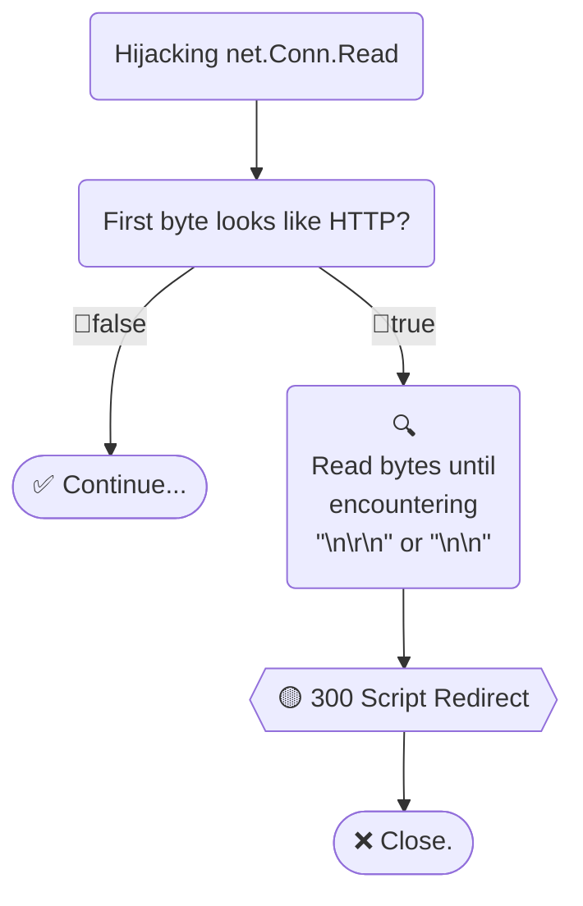

# Simple HTTPS Listener For HTTP Redirect

Full version: [hlfhr](../)

If client sent an HTTP request to an HTTPS server `port`, returns script redirect.

```html
<script>
	location.protocol = "https:";
</script>
```

---

## Get

```
go get github.com/bddjr/hlfhr
```

---

## Example

```go
// Use ListenAndServeTLS
srv := &http.Server{
	// Write something...
}
err := simplehlfhr.ListenAndServeTLS(srv, "localhost.crt", "localhost.key")
```

```go
// Use NewListener
srv := &http.Server{
	// Write something...
}

l, err := net.Listen("tcp", srv.Addr)
if err != nil {
	return err
}
defer l.Close()

l = simplehlfhr.NewListener(l, srv)
err = srv.ServeTLS(l, "localhost.crt", "localhost.key")
```

---

## Logic



### See

- [simple.go](simple.go)

---

## Test

```
git clone https://github.com/bddjr/hlfhr
cd hlfhr
cd simplehlfhr
./run.sh
```

---

## Reference

https://developer.mozilla.org/docs/Web/HTTP/Status/300

[hlfhr](../)

---

## License

[BSD-3-clause license](../LICENSE.txt)
