# Simple HTTPS Listener For HTTP Redirect

Full version: [hlfhr](../)

If client sent an HTTP request to an HTTPS server `port`, returns script redirect.

```html
<script>
	location.protocol = "https:";
</script>
```

---

## Get

```
go get github.com/bddjr/hlfhr
```

---

## Logic

```mermaid
flowchart TD
	Read("Hijacking net.Conn.Read")

	IsLooksLikeHTTP("First byte looks like HTTP?")

	Continue(["✅ Continue..."])

	ReadRequest("`🔍
	Read bytes until
	encountering
	#quot;\n\r\n#quot; or #quot;\n\n#quot;
	`")

	ScriptRedirect{{"🟡 300 Script Redirect"}}

	Close(["❌ Close."])

    Read --> IsLooksLikeHTTP
    IsLooksLikeHTTP -- "🔐false" --> Continue
    IsLooksLikeHTTP -- "📄true" --> ReadRequest --> ScriptRedirect --> Close
```



### See

- [simple.go](simple.go)

---

## Example

```go
// Use ListenAndServeTLS

func main() {
	srv := &http.Server{
		Addr:              ":5677",
		Handler:           http.HandlerFunc(httpResponseHandle),
		ReadHeaderTimeout: 10 * time.Second,
	}

	// Use ListenAndServeTLS
	err := simplehlfhr.ListenAndServeTLS(srv, "localhost.crt", "localhost.key")
	if err != nil && !errors.Is(err, http.ErrServerClosed) {
		panic(err)
	}
}
```

```go
// Use NewListener

func main() {
	srv := &http.Server{
		Addr:              ":5677",
		Handler:           http.HandlerFunc(httpResponseHandle),
		ReadHeaderTimeout: 10 * time.Second,
	}

	l, err := net.Listen("tcp", srv.Addr)
	if err != nil {
		fmt.Println(err)
		return
	}
	defer l.Close()

	// Use NewListener
	l = simplehlfhr.NewListener(l, srv)

	// Must use ServeTLS! For issue https://github.com/bddjr/hlfhr/issues/4
	err = srv.ServeTLS(l, "localhost.crt", "localhost.key")
	fmt.Println(err)
}
```

---

## Test

```
git clone https://github.com/bddjr/hlfhr
cd hlfhr
cd simplehlfhr
./run.sh
```

---

## Reference

https://developer.mozilla.org/docs/Web/HTTP/Status/300

[hlfhr](../)

---

## License

[BSD-3-clause license](../LICENSE.txt)
